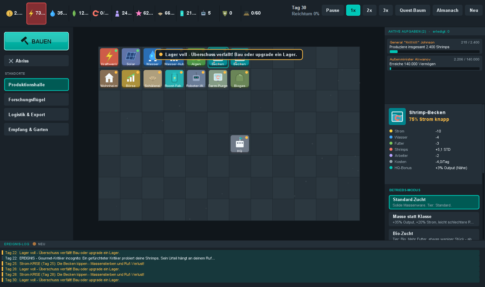
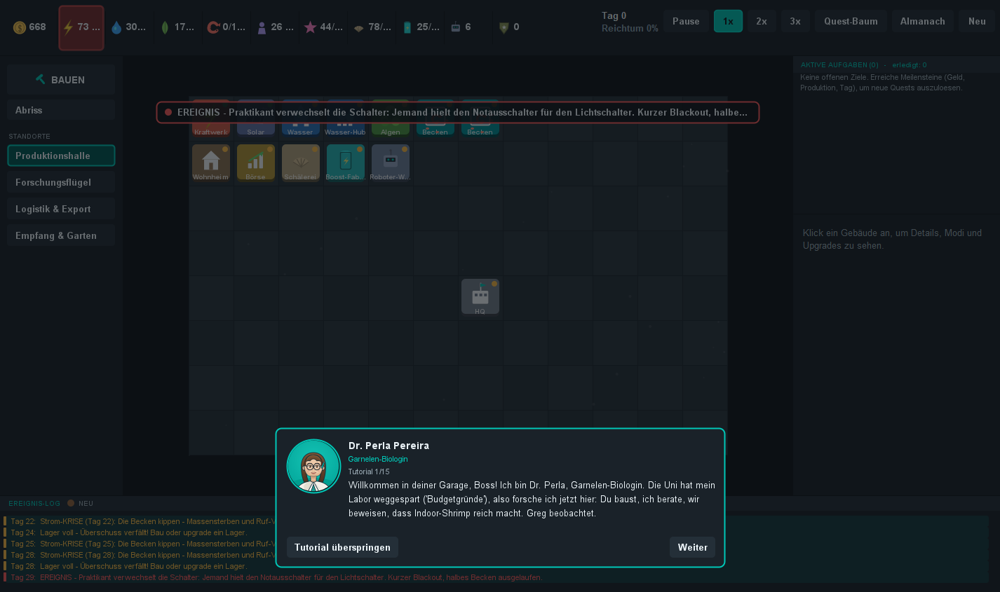
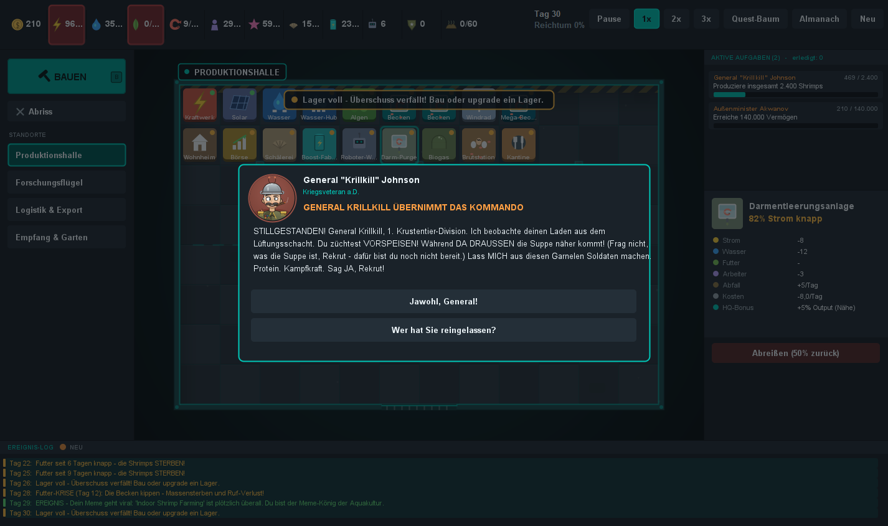

# 🦐 ShrimpTopia v2 — Indoor Shrimp Farming Tycoon

Eine humorvolle Aufbau-Wirtschaftssimulation im Stil von **Tropico** und **Surviving Mars**,
ganz dem Meme des *Indoor Shrimp Farming* gewidmet.

Reines **Java 17 + Swing** — eine eigenständige Desktop-Anwendung, **kein** Webspiel,
ohne externe Bibliotheken. Läuft überall mit JDK/JRE 17+.



---

## ▶️ Schnellstart

```
run.bat
```
oder direkt:
```
java -jar ShrimpTopia.jar
```

Selbst neu bauen (JDK 17+):
```
build.bat
```

---

## ✨ Neu in v2

| Bereich | Inhalt |
|---|---|
| **Tutorial** | 15-Schritte-Einführung mit Advisor **Dr. Perla Pereira**; Spotlight hebt die jeweils relevante UI hervor, du baust die Produktionskette geführt auf. |
| **Quests & Storylines** | Tropico-Stil-Popups mit Portrait & Auswahl-Buttons: 16 Quests (4 Ketten — Behörde, Tierschutz, Influencer, Konkurrenz — + 7 Einzelquests). |
| **Zwei Charaktere** | **General „Krillkill" Johnson** (7-stufige „Operation Protein-Sturm", inkl. dunklem Geheimnis) und **Außenminister Ivan Akwanov** aus Usbekistan (8-stufige Rivalität mit Embargo, Sabotage & drei Enden). |
| **Shrimp-Tiers** | 6 Qualitätsstufen: Standard → Bio → Gourmet → Protein-Bombe → Designer → **Kampf-Krill**. Höhere Tiers sind wertvoller, teils kontrovers (−Reputation). |
| **Premium-Veredelung** | **Gourmet-Shrimps** gibt es nur mit leerem Darm: erst die **Darmentleerungsanlage** (Reinheits-Auditorin **Reinhild Darmstädter**) bauen — sie spült die Garnelen sauber, erzeugt dabei aber **Klärschlamm**, den eine **Biogas-Kläranlage** entsorgen muss (sonst stinkt's, −Reputation). Danach reifen in der **Riff-Kuppel** Gourmet-Shrimps ab Werk. |
| **Boygroup!** | Star-Produzent **Siggi Scampi** entdeckt fünf singende Garnelen in Becken 2: Casting, Trainingsmontage, Debüt-Single **„Butterfly (In My Becken)"** — und dazwischen flüstert es *„kauf Shrimps"*. Die 6-stufige Kette schaltet die **Show-Bühne** und den Marketing-Stream **Subliminal-Pop** frei, dessen Nachfrage mit eurer Reputation skaliert. |
| **Quest-Minigames** | Sechs Geschicklichkeits-Minigames mit eigenen Mechaniken, eingebettet an passenden Quest-Momenten — die Belohnung skaliert mit deinem Können (und dem Einsatz): **Operation Krill-Kommando** (Moorhuhn-Shooter im Usbekistan-Krieg — nicht auf Greg schießen!), **Boygroup-Bootcamp** (4-Spuren-Rhythmusspiel, A/S/D/F), **Feilsch-o-Mat** (Timing-Bar bei Verhandlungen), **Blackout!** (Sicherungs-Whack-a-Mole), **Großputz** (Algen wegschrubben vor der Behörden-Prüfung), **Darm-Kontrolle** (Fließband-Sortierung für Reinhild). |
| **43 Gebäude** | Jede Bau-Kategorie hat jetzt mindestens 6 Gebäude — vom **Garnelen-Laufrad** (Strom aus Sport) über **Brutstation**, **Mega-Becken** (Becken-Ausbaustufe 3) und **Kühlhaus** bis zu **Greg-Denkmal** und **Geothermie-Bohrung**. Das Schalentier-Kraftwerk verfeuert jetzt wirklich Schalen (Fernwärme-Gutschrift). |
| **Märkte** | Verkaufsorte akzeptieren nur **bestimmte** Tiers: Börse (Standard/Bio), Restaurant (bis Gourmet), Export-Hafen, Militär-Depot (Krillkill), Schwarzmarkt. Falsches Tier am falschen Markt = kein Verkauf. |
| **Inspektor** | Surviving-Mars-artiges Detail-Panel rechts: Live-Durchsatz, Status, Modus-Wahl, Upgrade-Käufe. |
| **Modi & Upgrades** | Jedes Gebäude hat Betriebs-Modi (Trade-offs) und Upgrades — viele wirken **farmweit** (z.B. Strom-Spar, Wasser-Boost, Preis-Bonus). Dazu 4 **Arbeiter-Politiken**. |
| **Zonen** | 4 themenbezogene Bereiche mit klar unterscheidbarer Optik — eigener Boden, Signaturfarbe, Deko und Karten-Schild: **Produktion** (industrielle Halle mit Warnband & Fahrbahn — als **Garage** noch warmer Ölboden bei Funzellicht), **Forschung** (Knotengitter & Leiterbahn), **Logistik** (Verladespuren mit Pfeilen), **Empfang & Garten** (Steinpfad, Grasbüschel, Teich). Wechsel über die Seitenleiste links. |
| **Lebendigkeit** | Schwimmende Shrimps in den Becken (Farbe = Tier), zonenspezifische Schwebeteilchen (Staub, Dampf, Glühfunken, fallende Blätter), pulsierende Auswahl. |
| **Progression** | Zonen, Tiers, Gebäude & Mechaniken schalten sich über Meilensteine und Quest-Entscheidungen nach und nach frei. |




---

## 🎮 Steuerung

| Aktion | Eingabe |
|---|---|
| Baumenü öffnen | **BAUEN**-Knopf links, Taste **B** oder **Rechtsklick** auf die Karte |
| Gebäude wählen / platzieren | Klick im **Baumenü**, dann **Linksklick** auf ein freies Feld |
| Gebäude inspizieren | **Linksklick** auf ein platziertes Gebäude → Inspektor rechts |
| Modus wählen / Upgrade kaufen | im **Inspektor** anklicken |
| Zone wechseln | **STANDORTE**-Knöpfe in der Seitenleiste links |
| Abriss | **Abriss**-Knopf links, dann Gebäude anklicken (50 % zurück) |
| Pause / Tempo | **Leertaste** / **1 2 3** (oder Buttons oben rechts) |
| Auswahl/Modus abbrechen | **Rechtsklick** oder **ESC** |
| Quest beantworten | Auswahl-Button im Popup |

---

## 🧠 Spielprinzip

```
Kraftwerk/Solar ─► STROM ─► Wasserwerk/Hub ─► WASSER ┐
                                Algenfarm ─► FUTTER  ┤
                                                     ▼
                          Shrimp-Becken (Modus = Tier) ─► SHRIMPS (je Tier)
                                                     │
        ┌──────────────┬─────────────┬──────────────┤
        ▼              ▼             ▼              ▼
     Börse        Restaurant    Export-Hafen   Militär-Depot / Schwarzmarkt
   (Std/Bio)    (bis Gourmet)  (Bio–Designer)  (Protein / Kampf-Krill)
        └──────────────┴─────────────┴──────────────┘  ─► GELD
```

- **Strom & Arbeiter** begrenzen den Betrieb (Brownout / Personalmangel drosseln alles).
- **Wasser & Futter** sind Lager — laufen sie leer, sterben Shrimps.
- **Reputation** (0–100) skaliert den Verkaufspreis (0,6×–1,4×). Restaurants, Labore, Solar & Besucherzentrum heben sie; Kraftwerke, Schwarzmarkt & kontroverse Tiers senken sie.
- **Becken-Modus** legt das produzierte **Tier** fest (höhere Tiers brauchen Freischaltung via Forschung/Quests). Verkaufe jedes Tier am passenden Markt.
- **Ziel:** 1.500.000 Geld = Shrimp-Imperator (eines von 6 Spielenden, danach Sandbox). **Pleite:** zu lange im Minus → Bank pfändet.

---

## 🧩 Architektur

```
src/com/shrimptopia/
  Main.java                 Einstieg (+ --selftest / --guitest)
  model/                    GameState (Simulation), BuildingType (+Meta), BuildingCatalog
                            (Modi/Upgrades), ShrimpTier, Mode, Upgrade, FarmModifiers, Stats,
                            Zone, WorkerPolicy, Building, GlobalEffect, ResourceType, IconKind
  events/                   EventSystem, GameEvent (Zufallsereignisse)
  quest/                    QuestSystem, Quest, Choice, Condition, QuestEffect, GameCharacter,
                            QuestContent (alle Quests + Krillkill/Akwanov)
  tutorial/                 Tutorial, TutorialStep, TutorialContent (15 Schritte)
  ui/                       GameFrame (Spielschleife, Overlay, Zonen), OverlayHost (Tutorial+Popup),
                            InspectorPanel, MapPanel, SidePanel, ZoneTabs, TopBar, LogPanel,
                            ThemeButton, Icons (Vektor-Symbole + Portraits), Palette
design/                     Generierte Design-Dokumente (Tiers, Modi, Zonen, Quests, Charaktere, Tutorial)
```

### Headless-Tests (ohne Fenster)
```
java -jar ShrimpTopia.jar --selftest   # simuliert 120 Tage, prüft die Wirtschaft in der Konsole
java -jar ShrimpTopia.jar --guitest    # rendert Tutorial / Haupt-UI / Quest-Popup in PNGs (Temp)
```

### Erweitern
- **Quest/Storyline:** Eintrag in `quest/QuestContent.java` (Bedingung, Geber, Text, Optionen mit Effekten).
- **Gebäude:** neue `BuildingType`-Konstante + Eintrag in der Meta-Registry (Zone, Markt, Freischaltung).
- **Modus/Upgrade:** in `model/BuildingCatalog.java`.
- **Tier/Markt:** `ShrimpTier` + `acceptedTiers` am Markt-Gebäude.

Viel Spaß beim Aufbau deines Shrimp-Imperiums! 🦐
